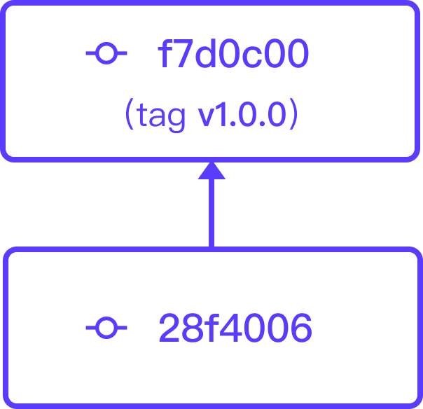
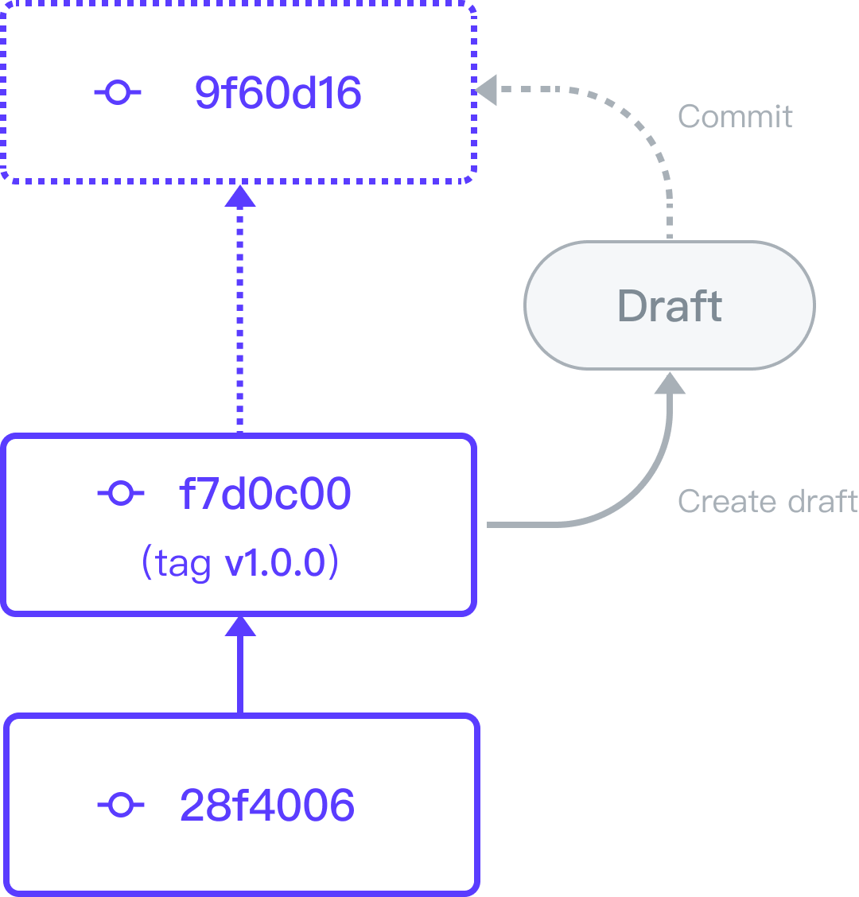
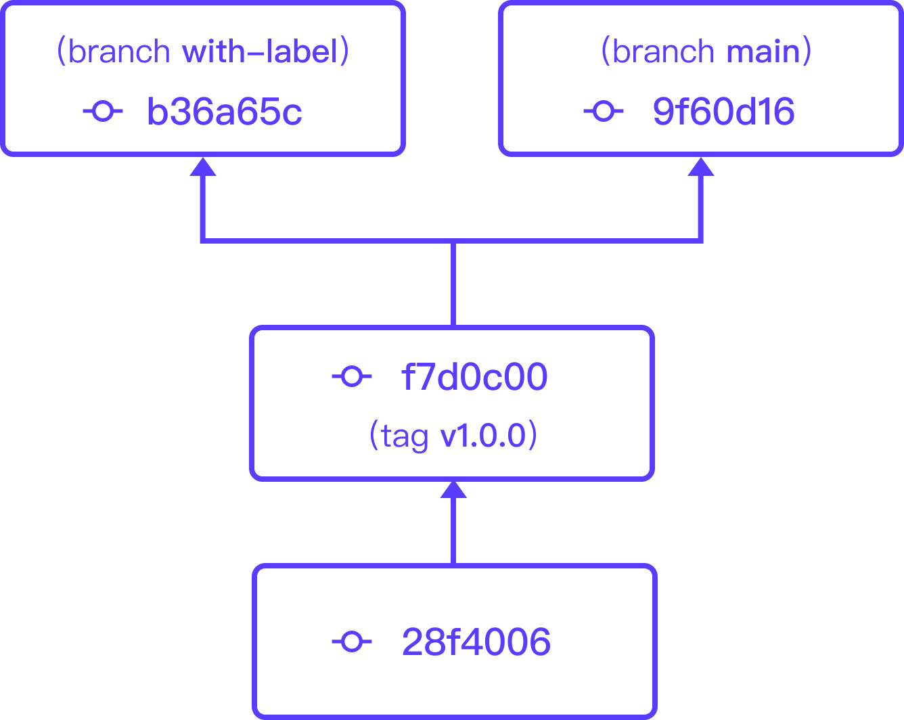

#################
 Version Control
#################

TensorBay supports dataset version control.
There can be multiple versions in one dataset.

********
 Commit
********

TensorBay implements version control feature via :ref:`reference/glossary:commit`.
Each commit of a TensorBay dataset is a **read-only** version.
Take the `VersionControlDemo Dataset <https://gas.graviti.cn/dataset/data-decorators/VersionControlDemo>`_ as an example.
At the very beginning, there are only two commits in this dataset as demonstrated in :numref:`Fig. %s <commit-demonstration>`.

.. _commit-demonstration:

   First two commits of dataset "VersionControlDemo".

.. note::
   "VersionControlDemo" is an open dataset on `Graviti Open Datasets <https://www.graviti.cn/>`_ platform,
   Please fork it before running the following code block.

Checkout to the first commit, check the data amount.

.. code:: python
   
   from tensorbay import GAS
   from tensorbay.dataset import Dataset

   ACCESS_KEY = "Accesskey-*****"
   gas = GAS(ACCESS_KEY)
   commits = dataset_client.list_commits()

   FIRST_COMMIT_ID = "28f40062271d480ea9be39e7d1beb64a"
   version_control_demo = Dataset("VersionControlDemo", gas, revision=FIRST_COMMIT_ID)
   train_segment = version_control_demo["train"]
   print(f"data number: {len(train_segment)}.")
   # data number: 4.

There are 4 data in the train segment.

Checkout to the second commit and check the data amount.

.. code:: python
   
   SECOND_COMMIT_ID = "f7d0c00cc1824097b10f7846353697cc"
   version_control_demo = Dataset("VersionControlDemo", gas, revision=SECOND_COMMIT_ID)
   train_segment = version_control_demo["train"]
   print(f"data number: {len(train_segment)}.")
   # data number: 8.

There are 8 data in the train segment.

See :ref:`version_control/draft_and_commit:Draft and Commit` for more details about commit.

*******
 Draft
*******

So how to create a dataset with multiple commits?
Actually, each commit comes from a :ref:`reference/glossary:draft`.
A draft is a concept that represents a **writable** workspace, which is built upon a commit.
Typical steps to create a new commit:

- Create a draft.
- Do the modifications/update.
- Commit the draft.

:numref:`Figure. %s <draft-demonstration>` demonstrates the relations between a draft and commits.

.. _draft-demonstration:

   The relations between a draft and commits.

The following code block creates a draft and adds a new segment to the "VersionControlDemo" dataset.

.. code:: python

   import os
   from tensorbay.dataset import Segment

   TEST_IMAGES_PATH = "path/to/test_images"

   dataset_client = gas.get_dataset("VersionControlDemo")
   dataset_client.create_draft("draft-1")

   test_segment =Segment("test")

   for image_name in os.listdir(TEST_IMAGES_PATH):
       data = Data(os.path.join(TEST_IMAGES_PATH, image_name))
       test_segment.append(data)

   dataset_client.upload_segment(test_segment, jobs=8)
   dataset_client.commit("add test segment")

See :ref:`version_control/draft_and_commit:Draft and Commit` for more details about draft.

*****
 Tag
*****

For the convenience of marking major commits and switching between different commits,
TensorBay provides the :ref:`reference/glossary:tag` concept.
The typical usage of tag is to mark release revisions.

The tag "v1.0.0" in :numref:`Fig. %s <commit-demonstration>` is added by

.. code:: python

   dataset_client.create_tag("v1.0.0", revision=SECOND_COMMIT_ID)

See :ref:`version_control/tag:Tag` for more details about tag.

********
 Branch
********

Sometimes, users may need to create drafts upon an early (not the latest) commit.
For example, in an algorithm team, each team member may do modifications/update to every existed commit.
This means a commit list may turn into a commit tree.

For the convenience of maintaining a commit tree, TensorBay provides the :ref:`reference/glossary:branch` concept.

Actually, the commit list (:numref:`Fig. %s <commit-demonstration>`) above is the default branch named "main".

The code block below create a branch "with-label" based on the :ref:`reference/glossary:revision` "v1.0.0",
and add :ref:`classification <reference/label_format:Classification>` label to the "train" segment.

:numref:`Figure. %s <branch-demonstration>` demonstrates the two branches.

.. _branch-demonstration:

   The relations between branches.

.. code:: python

   TRAIN_IMAGES_PATH = "path/to/train/images"

   dataset_client.create_branch("with-label", revision="v1.0.0")
   dataset_client.checkout(revision="with-label")
   dataset_client.create_draft("draft-2")

   train_segment = Segment("train")
   train_segment_client = dataset_client.get_segment(train_segment.name)

   for image_name in os.listdir("path/to/train_images/"):
       data = Data(os.path.join(TRAIN_IMAGES_PATH, image_name)
       data.label.classification = Classification(image_name[:5])
       train_segment.append(data)

   for data in train_segment:
       train_segment_client.upload_label(data)

   dataset_client.commit("add labels to train segment")

See :ref:`version_control/branch:Branch` for more details about branch.

**************
 More Details
**************

.. toctree::
   :maxdepth: 1

   ../version_control/draft_and_commit
   ../version_control/branch
   ../version_control/tag
